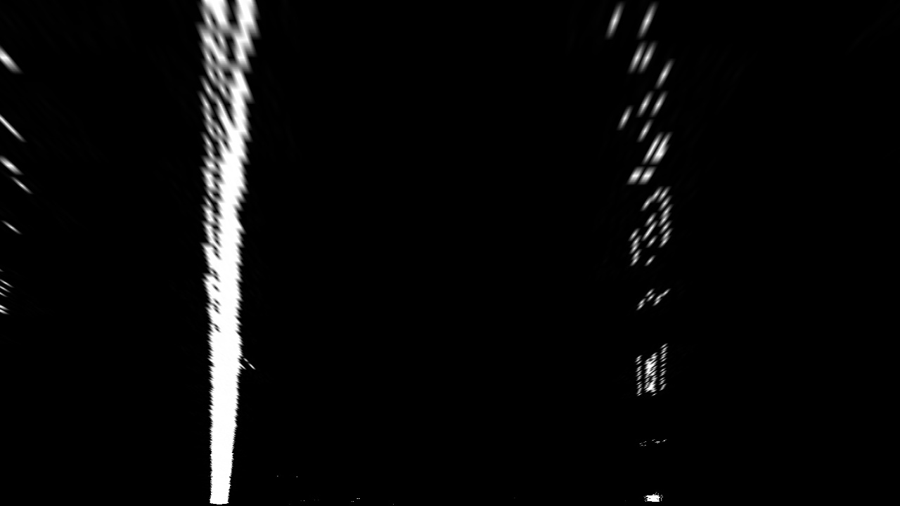
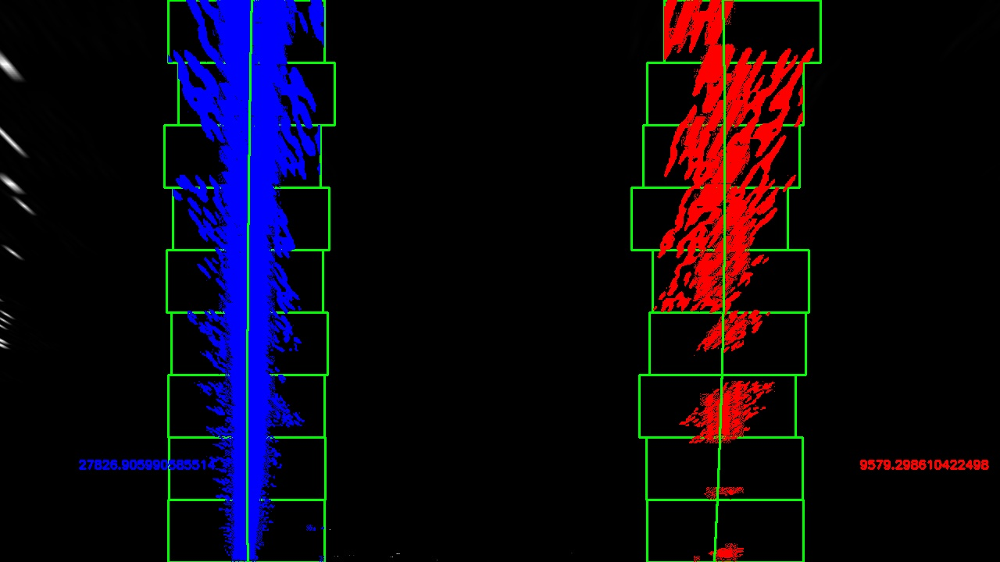
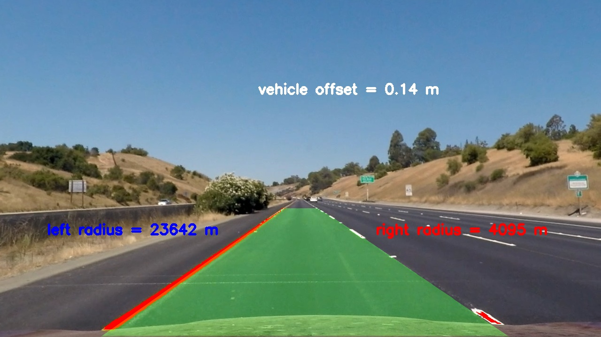

## Advanced Lane Finding

### Step 0: My Pipeline

My pipeline consisted of 10 steps. 
1. Obtain chessboard camera images and find corners
2. Calibrate and Undistort camera images  
3. Perspective transform chessboard to only project grids

4. Obtain lane line camera images 
5. Undistort the lane images  
6. Detect edges using thresholds (Sobel X, Sobel Y, Sobely XY, Gradient, and HLS) 
7. Find the region of interest (ROI)  
8. Perspective transform lane lines based on ROI  
9. Find peak (plot histogram) and moving window to find lanes  
10. Find curvatures, offsets of the image  
    
This pipeline has been applied to both images and videos  

Images corresponding to each step has been stored with their step number  
EX: 5_test_images_undist  
  
  
# Camera Calibration

### Step 1: Obtain chessboard camera images/ find corners
I first used the 20 raw chessboard camera images of the chess board to find the **distortion coefficients** and the **camera matrix** for undistorting the images.  
Used the following opencv equation  
* ret, corners = cv2.findChessboardCorners(gray, (9,6),None)  
to find the corners of the image. 
  

Sample Camera Image  

### Step 2: Correct for distortion (undistort)
The following equations were used:  
* ret, mtx, dist, rvecs, tvecs = cv2.calibrateCamera(objpoints,imgpoints, img.shape[1:], None, None)  
* undist = cv2.undistort(img, mtx, dist, None, mtx)  
where mtx and dist are the **camera matrix** and the **distortion coefficients**
  

Undistorting the raw camera picture.  

### Step 3: Perspective Transform (warp images)  
Two things were done before doing the transform:
1. Find the 4 source points corresponding to chessboard corner
2. Find the 4 destination points corresponding to where in an image the bound by the source points should be projected to  

I then applied the following equations:  
* M = cv2.getPerspectiveTransform(src, dst)
* warped = cv2.warpPerspective(img, M, img_size)  
  

Applied perspective transform on the image to show only the grid cells.

# Lane Line Images

### Step 4: Lane Line Image

This is a sample lane line image.

### Step 5: Undistort Lane Line Image
Referring to the equations used in step 2, I have undistorted all the lane line images.  

Undistort the lane line image using the calibration information from STEP 2.

### Step 6: Apply thresholds (Sobel, Gradient, HLS, etc)
I applied the **sobel** operator as well as manipulating the **HLS** color space to find the edges  

Equations used were: 
* gray = cv2.cvtColor(img, cv2.COLOR_BGR2GRAY)
* sobel_img = cv2.Sobel(gray, cv2.CV_64F, 1, 0)
* hls = cv2.cvtColor(img, cv2.COLOR_BGR2HLS)
  
I combined all the various thresholds to obtain the final step (last image in this step).  

Applying Sobel thresholds X

Applying Sobel thresholds Y

Applying Sobel thresholds for both X and Y

Applying the Sobel Gradient

Combining the Sobel Thresholds 

Applying H and L (HLS) thrsholds

Combining Sobel and HLS threshold

### Step 7: Region of Interest
After finding the edges in the images, my next steps were to find the **Region of Interest** where the lane lines were in the image.  

The region of interest that I have chosen 

Sanity check to check that the warp looks good

### Step 8: Warping the binary Image  
I then applied the **perspective** transform on the lane lines based on the ROI.  

Perspective transformed image of lane lines

### Step 9: Histogram and Sliding Window Line Detect
Using a histogram plot, I was able to find the peak for each row of the images. 

Histogram plot to find the left and right lanes.

### Step 10: Final output
After finding the pixels related to the lane lines, two things were left:
1. Find the polyfit equations
2. Find the curvature from the polyfit equations.
3. Find the offset of vehicle.
  
I used the following equations to acheive this:
* left_fit = np.polyfit(lefty, leftx, 2)
* left_curverad = ((1 + (2*left_fit[0]*y_eval*ym_per_pix + left_fit[1])**2)**1.5) / np.absolute(2*left_fit[0])
  
Offset was calculated by:
* real_mid = imshape[1]//2
* img_mid = (left_fitx[imshape[0]-1] + right_fitx[imshape[0]-1]) // 2
* offset = (real_mid - img_mid) * xm_per_pix
  
YES DONE!! 

### Discussion Points
1. What problems/issues existed?
* The tuning of the tresholds for white dashed lines.
* The speed of the algorithm
2. Where will the pipeline fail?
* If the images contained multiple lines (cracks, etc).
* If the images contain too drastic curvatures (because using one ROI)
3. How to make it more robost?
* Better tuning of the thresholds for detecting lines