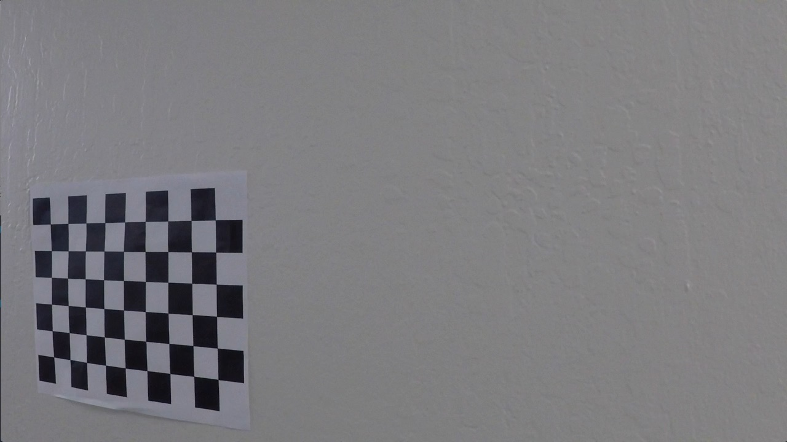

## Advanced Lane Finding

### Step 0: My Pipeline

My pipeline consisted of 10 steps. 
    1. Obtain distorted camera images
    2. Calibrate and Undistort camera images
    3. Transform/warp the camera images to project same to dimensions
    4. Export lane images
    5. Undistort the lane images
    6. Apply thresholds (Sobel X, Sobel Y, Sobely XY, Gradient, and HLS)
    7. Find the region of interest (ROI)
    8. Warp binary image
    9. Apply histogram filter and moving window to find lanes
    10. Find curvatures, offsets of the image
    
This pipeline has been applied to both images and videos

# Camera Calibration

### Step 1: Camera Image

This is a sample camera picture.

### Step 2: Calibrate and Undistort Raw Image

Undistorting the raw camera picture.

### Step 3: Transform/Warp Image

Warp the image to show only the grid cells.

# Lane Line Images

### Step 4: Lane Line Image

This is a sample lane line image.

### Step 5: Undistort Lane Line Image

Undistort the lane line image using the calibration information from STEP 2.

### Step 6: Apply thresholds (Sobel, Gradient, HLS, etc)

Applying Sobel thresholds X

Applying Sobel thresholds Y

Applying Sobel thresholds for both X and Y

Applying the Sobel Gradient

Combining the Sobel Thresholds 

Applying H and L (HLS) thresholds

Combining Sobel and HLS threshold

### Step 7: Region of Interest

The region of interest that I have chosen 

Sanity check to check that the warp looks good

### Step 8: Warping the binary Image

Applying histogram filter to find the left and right lanes.

### Step 9: Histogram and Sliding Window Line Detect

Applying histogram filter to find the left and right lanes.

### Step 10: Final output

